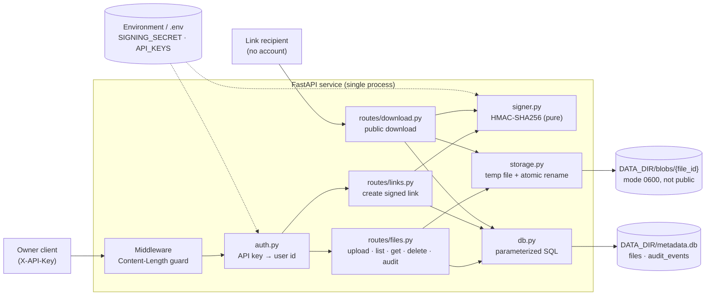
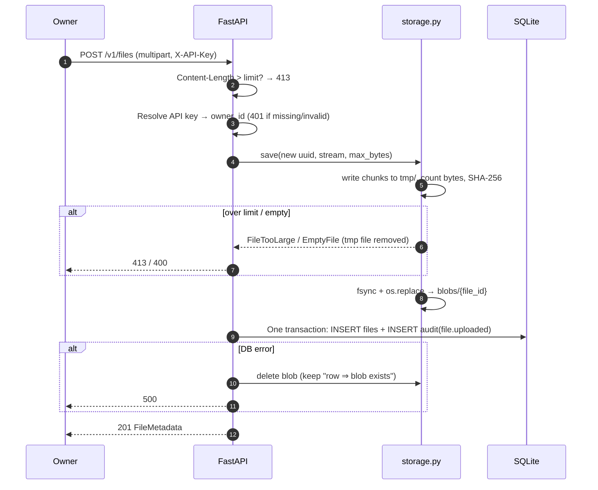
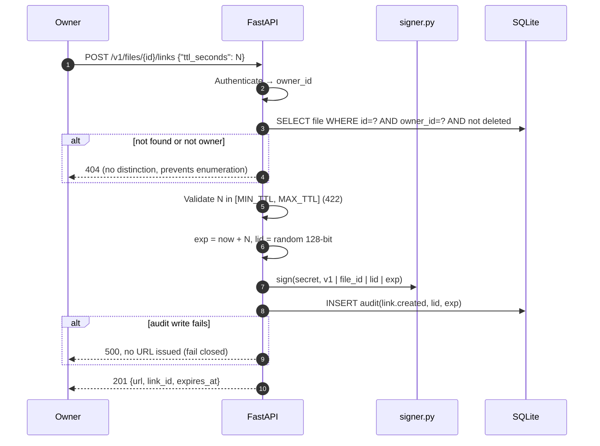
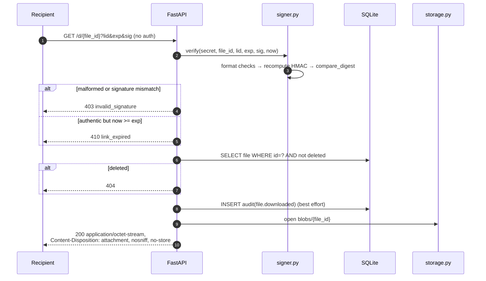

# Architecture

A single FastAPI process with two pieces of local state: a SQLite database for
metadata and audit events, and a private directory for file content. There is no
other infrastructure.

## Components

Everything that must survive a restart lives outside the process: the signing
secret comes from configuration, metadata is in SQLite, and content is on disk.
That is why a link signed before a restart still verifies after it.

## Request lifecycle: upload

## Request lifecycle: create signed link

## Request lifecycle: public download

Signature verification needs no database lookup (stateless). The database is only
consulted afterwards to make sure the file has not been deleted.
